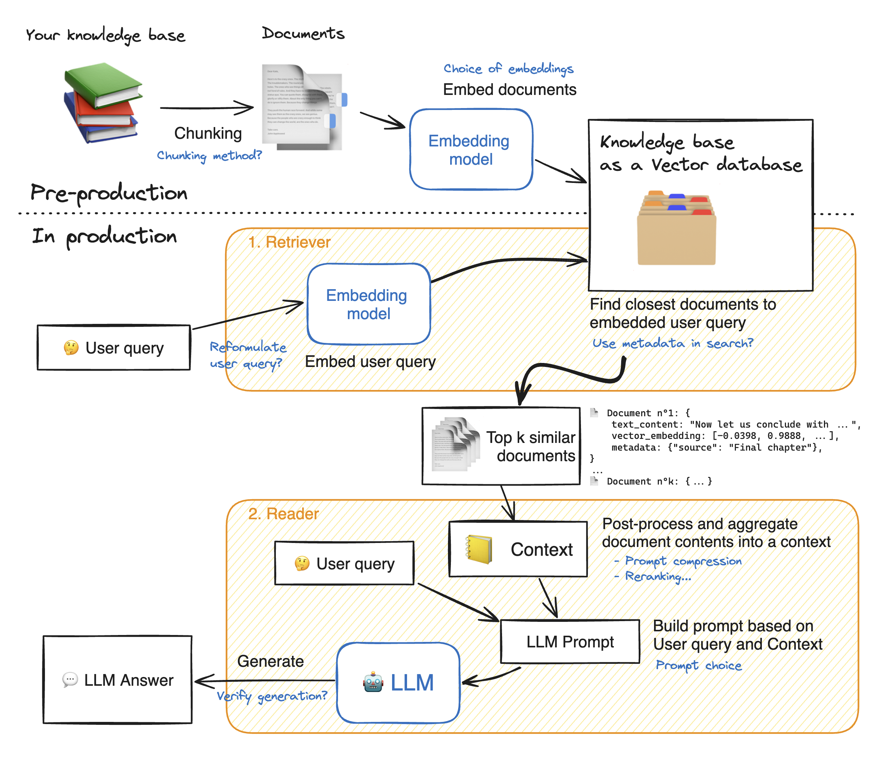

RAG -> Retrieval Augumented Generation

### Definition

Retrieval-Augmented Generation (RAG) is an AI technique that combines information retrieval with text generation to enhance the accuracy and relevance of responses. Instead of relying solely on a model’s internal knowledge, RAG first retrieves relevant documents from an external knowledge source (e.g., a vector database) and then generates a response based on both the retrieved content and the model’s reasoning ability.

### Steps to build RAG:-
1. Query Translation (Translate the ques into a form that is better suited for query retrieval)
2. Routing (Logical / Semantic)
3. Query Construction
(main steps :)
4. Indexing
5. Retrieval
6. Generation (Active Retrieval) 

