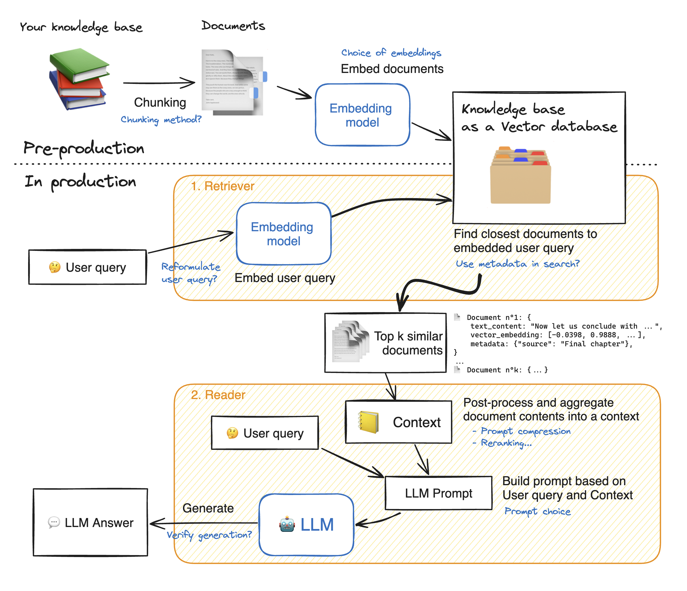

# Medibot
It is an **AI-powered chatbot** that provides quick, informative and conversational responses to common medical queries.Built using Streamlit and Mistral models, it aims to offer accessible healthcare related information, leveraging Retrieval Augmented Generation (RAG) for factual accuracy.

---

## Features

- Conversational AI powered by open weight LLM.
- Integrates **Mistral language model** for response generation. 
- Fast and lightweight Streamlit UI.
- Uses a **Retrieval Augmented Generation (RAG)** architecture to ground responses in specific knowledge, ensuring better reliability.

---

## Tech Stack
- **Frontend**: Streamlit
- **Backend**: Python, Mistral

---

## Getting Started 

### 1. Clone the repository

```bash
git clone https://github.com/sakii-11/Medibot.git
cd Medibot
```

### 2. Install dependencies 
Python version - 3.9+
```bash
pip install -r requirements.txt
```
### ⚠️ **Important Setup Note: Virtual Environment**

If you encounter **"Import could not be resolved"** errors in your IDE (like VS Code/Pylance), ensure you have activated your virtual environment (`.\venv\Scripts\Activate.ps1`) and that your IDE is configured to use the **Python interpreter located inside your project's `venv` folder**.

### 3. Environment Variables 
Create a `.env` file in the root directory and add the following:

```env
MODEL_API_URL=<your_llm_api_endpoints>
MODEL_NAME=<model_name>
```

### 4. Run the Streamlit app
```bash
streamlit run medibot.py
```

---
## RAG -> Retrieval Augmented Generation


### Definition

Retrieval-Augmented Generation (RAG) is an AI technique that combines information retrieval with text generation to enhance the accuracy and relevance of responses. Instead of relying solely on a model’s internal knowledge, RAG first retrieves relevant documents from an external knowledge source (e.g., a vector database) and then generates a response based on both the retrieved content and the model’s reasoning ability.


### Steps to build RAG:-
1. Query Translation (Translate the question into a form that is better suited for query retrieval)
2. Routing (Logical / Semantic)
3. Query Construction (main steps :)
4. Indexing
5. Retrieval
6. Generation (Active Retrieval) 

---

## Contributing

Contributions are welcome! To contribute:

1. Fork the repository
2. Create a new branch (`git checkout -b feature-name`)
3. Commit your changes (`git commit -m 'Add feature'`)
4. Push to the branch (`git push origin feature-name`)
5. Open a pull request

---

## Author

- [@sakii.codes](https://github.com/sakii-11)

---

## License

This project is licensed under the [MIT License](LICENSE).